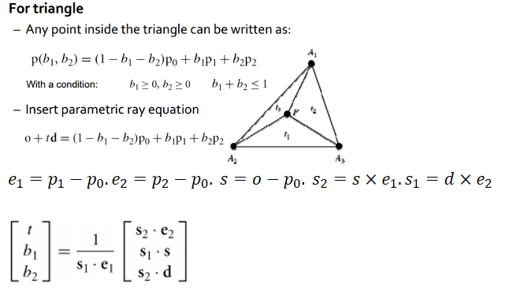

# CG Assignment3 Report

刘文基  liuwj@shanghaitech.edu.cn ID:13611756

## Introduction

What we are required to complete in this assignment are listed below:

+ Camera Ray Generation
+ Ray Intersection with multiple objects (Quad,Triangle,Sphere,Mesh)
+ Sample on a hemisphere.
+ Reflected Ray Generation and Refracted Ray Generation
+ Ray Tracing on multiple surfaces (Diffuse,Specular, Refraction,Fresnel)

In this assignment, i did not implement the bidirectional path tracing. Instead, just a simple backward light tracing algorithm.

## Camera Ray Generation

Camera Ray Generation is to generation a ray which starts from optical center  and pass through one pixel of the image plane.

The main point is to generate the ray direction.

Assume the optical center is at the world origin is a good idea. Since it does not effect the ray direction.

The image plane should be have a width of 
$$
[\pm0.5*tan(cameraHorizFOV / 2  )*aspectRatio *nearPlaneDistance]
$$
Have a height of 
$$
[\pm0.5* tan(cameraVerticalFOV / 2 ) *nearPlaneDistance]
$$
The difference is aspectRatio which describes the proportion of width under height.

Under our assumption, the depth is `nearPlaneDistance` .

Now the point is in the range of  height(0,300),width(0,300).

Normalize to [-1,1]  with $2*( x/width)-1$.

Take camera orientaion into consideration :

```c++
Ray Camera::get_ray(int x, int y, bool jitter, unsigned short * Xi)
	{
		double x_new = x, y_new = y;
		if (jitter)
		{
			x_new += erand48(Xi); // jitter the sample
			y_new += erand48(Xi);
		}
		x_new = 2 * ((x_new + 0.5) / _imageW) - 1;
		y_new =  2 * ((y_new + 0.5) / _imageH)-1;
		
		Vector3d Px = _cameraRight *x_new * tan(_cameraHorizFOV / 2  )* _aspectRatio *_nearPlaneDistance;
		Vector3d Py = _cameraUp*y_new * tan(_cameraVerticalFOV / 2 ) *_nearPlaneDistance;
		Vector3d Pz = _nearPlaneDistance*_cameraFwd;

		Vector3d rayDirection =Px+Py+ Pz;

		rayDirection = rayDirection.normalized(); // it's a direction so don't forget to normalize 
		return Ray(_position, rayDirection);

	}
```

##Ray Intersection with multiple objects 

### Quad Intersection

Quad is a range-limited plane. A plane can be described as $N^Tx = c$,$N$ is normal,$x$ is the point on the plane.

With ray eqution $o+td = x$, we can solve out $t = \frac{c-N^To}{N^Td}$.

The next step to validate if the point is in the range of  the quad.

Since we have four points of the quad, it's quite simple.

### Triangle Intersection



Then validate if $t>0,b1>0,b2>0 , b1+b2<1$

### Sphere Intersection


The only point to notice is that the sphere is not always at the origin, thus the $o_x,o_y,o_z$ in the equation should be replaced with $o-p$. $o$ is the ray origin, $p$ is the sphere's center position.

### Mesh Intersection (Acceleration)

Mesh is composed of triangles. The basic is to do triangle intersection.

But it's quite slow.To accelerate,we use a binary search partition. 

Using bounding box, we determine which triangle is indeed intersected by traversing the bouding box tree while saving a lot of time.

In the tree, the internal node is a AABB box, the leaf node is a exact triangle.


I use the morton code to do the partition.  The code is mainly referenced from  https://devblogs.nvidia.com/thinking-parallel-part-iii-tree-construction-gpu/ . While do a little edition on the box construction.

Morton code has spatial locality.The main idea of morton code is to first interleave 0 between the bit representation of the coordinate to get  $x',y',z'$ and then merge $x',y',z'$ to  the code $x'|y'|z'$.

After generating the morton code , sort them for faster split. The split can be done recursively.

First, select start,end and split position. Then use $start\oplus split$  and $split \oplus end$  to denote the differnce(by counting leading zeros). We should select split that is more similar to start, that should be a resonable partition.

if not suitable, choose a new binary split position.

## Sample on a hemisphere

To simulate a cosine sample distribution, (i.e. concerns light energy that are more close to the surface normal) we should use following equations under the assumption $p(\omega) = c * cos(\theta)$.

$\theta = 0.5*cos^{-1}(1-2*r_1)$,$\phi = 2*\pi*r2$

On which $\omega$ is the solid angle,  $cos(\theta) = N*Reflect\_dir$

The induction is listed below


 

do intergration to get $P(\theta) $ and $P(\phi|\theta)$ and get inverse function to get the formula of $\theta,\phi$.

Then do subsitution.


This is not enough,since this (x,y,z) is under the assumption  `N=(0,0,1)`

We should do a rotation based on the actual normal.  

$\hat{x} = n\times u, \hat{y} = \hat{x}\times n,\hat{z} = n$

the rotation is $T= (\hat{x}^T,\hat{y}^T,\hat{z}^T)$. 

Thus the ray direction should be  $T（x,y,z）^T$          

## Reflected Ray Generation and Refracted Ray Generation

### Reflected Ray Generation

+ For Diffuse surface, give a random reflection direction.

  ```c++
  reflect_direct = Vector3d(0, 0, 0);
  double r1 = erand48(Xi); double r2 = erand48(Xi);
  sampler::onHemisphere(n, &reflect_direct,r1, r2,&decrease);
  reflect_direct =reflect_direct.normalized();
  ```

+ For specular surface, do complete reflection.

  ```c++
  reflect_direct = Vector3d::reflect(r.direction(), n);
  reflect_direct = reflect_direct.normalized();
  decrease = n.normalized().dot(reflect_direct);
  ```

  $decrese = cos(\theta)$ in this case.

### [Refracted Ray Generation](https://www.scratchapixel.com/lessons/3d-basic-rendering/introduction-to-shading/reflection-refraction-fresnel)

```c++
Ray Material::get_refracted_ray(const Ray & r,Vector3d & p,const Vector3d & n,unsigned short * Xi) const
{
		float decrease = 1;
		Vector3d reflect_direct;
		float cosi = clamp(-1.0, 1.0, r.direction().dot(n));
		float etai = 1, etat = ior;
		Vector3d _normal = n;
		if (cosi < 0) {
			cosi = -cosi;
		}
		else {
			std::swap(etai, etat);
			_normal = -n;
		}
		float eta = etai / etat;
		float k = 1 - eta * eta * (1 - cosi * cosi);
		if (k < 0) {
			reflect_direct = Vector3d(0, 0, 0);
		}
		else {
			reflect_direct = r.direction()*eta + _normal*(eta * cosi - sqrtf(k));
		}
		reflect_direct = reflect_direct.normalized();
		decrease = n.normalized().dot(reflect_direct);
		Ray a = Ray(p, reflect_direct);
		a.attenuation = decrease;
		return a;
	}
```

ior is the rafraction rate. In this function we consider the case of light from air to water and from water to air and water to water. 


### Fresnel 

Fresnel is saving some of the energy are reflected  and some of the energy are refracted.

I also cover this effect and edit the code from [here](https://www.scratchapixel.com/lessons/3d-basic-rendering/introduction-to-shading/reflection-refraction-fresnel) to the the ratio of energy between reflection and  refraction.

## Ray Tracing on multiple surfaces 

### Logic:

+ if depth == max depth ,return (0,0,0)


+ if the ray does not intersect,return (0,0,0)
+ if intersect with certain object
  + if hit light, return light energy.else.....
  + calculate the direct illumination( concerning shadow)
  + calculate indirect illumination
    + if diffuse or specular
      + return direct_illumin + traceRay(reflected ray)
    + if refract
      + calculate kr 	with fresnel equation
      + return direct_illumin + kr* traceRay(reflected ray)+(1-kr)* traceRay(refracted ray)

### Code : 

```c++
Vector3d Scene::trace_ray(const Ray & ray, int depth, unsigned short * Xi)
	{
		bool inShadow = false; int hit_id = 0;
		ObjectIntersection intersect = this->intersect(ray, &hit_id);
		if (depth > max_depth) {
			return Vector3d(0, 0, 0);
		}
		
		if (intersect._hit) {
			if (ray.attenuation <= 0.001) {
				return Vector3d(0, 0, 0);
			}
			if (intersect._material.getType() == EMIT) {
				return intersect._material.get_emission();
			}
			Vector3d direct_color = shadowRay(ray, intersect, hit_id); 
            // if shadow count 0 ,else,count light energy.
			Vector3d diffuse_color = intersect._material.get_colour();

			Ray reflect_ray = intersect._material.get_reflected_ray(ray, ray.origin() + intersect._u*ray.direction(), intersect._normal, Xi);
			Vector3d indirect_color = trace_ray(reflect_ray, depth + 1, Xi);
			Vector3d reflect_color = direct_color*0.1 + diffuse_color*indirect_color*ray.attenuation;
			if (intersect._material.getType() == REFRC) {
				Vector3d refract_color(0, 0, 0);
				float kr=0;
				intersect._material.fresnel(ray.direction(), intersect._normal, kr);
				if (kr < 1) {
					Ray refract_ray = intersect._material.get_refracted_ray(ray, ray.origin() + intersect._u*ray.direction(), intersect._normal, Xi);
					refract_color = trace_ray(refract_ray, depth + 1, Xi);
				}
				return reflect_color*kr + refract_color*(1 - kr);
			}
			else {
				return reflect_color;
			}
			
		}
		else {
			return Vector3d(0, 0, 0);
		}
	}
```

## Result


render - reflect.png(10 samples per pixel, 2 light samples)


img/render -fresnel.png  (10 samples,2 light samples)


img/render -pure-refraction.png  (100 samples,2 light samples)


fresnel teddy + specular sphere (1000samples,20 light samples)